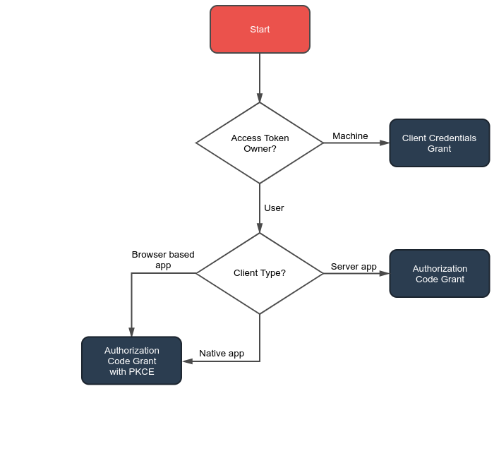

# OAuth2 Research and Introduction

### Simplified Intro

https://aaronparecki.com/oauth-2-simplified

### Which Grant Type to use

Stop using Implicit Grant

-   **system/cron/cli**: Client Credentials grant
-   **web-app/native app**: Authorization Code grant
-   **spa**: Authorization Code grant with PKCE

## Flow Details

### Client Credentials grant

Mostly for machine to machine communication.
-   system process
-   cli command
-   cron

https://oauth2.thephpleague.com/authorization-server/client-credentials-grant/

### Authorization Code Grant

There are 2 steps in this flow:
-   step 1, obtain the authorization_code
-   step 2, using the authorization code to obtain the access_token & referesh_token

https://oauth2.thephpleague.com/authorization-server/auth-code-grant/

### 

## Transparent Token vs Opaque Token

-   If you want the client to be able to parse the access token, you need the token to be transparent.
-   If you don't want the client to be able to parse the access token, you need the token to be opaque.
-   If your token is transparent, you must sign it,
-   benefit of having an opaque token is that you can just throw away any signing mechanism

## Social Authenticator

-   https://dev.to/_mertsimsek/integrate-oauth2-for-symfony-4-360c

## Tools and Library

### Server Implementation

-   https://www.ory.sh
-   https://oauth2.thephpleague.com/
-   https://github.com/trikoder/oauth2-bundle

### Client Library

-   https://oauth2-client.thephpleague.com/
-   https://github.com/thephpleague/oauth2-client
-   https://github.com/knpuniversity/oauth2-client-bundle

### Debug Client

-   https://oauthdebugger.com
-   https://oidcdebugger.com/
-   https://github.com/GetLevvel/oauth2-oidc-debugger
-   https://github.com/nbarbettini/oidc-debugger
-   https://github.com/ivarprudnikov/test-client-for-oauth2